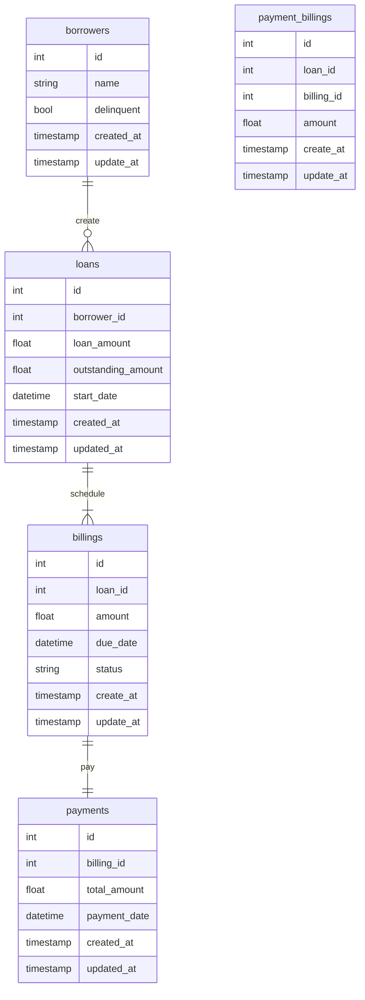

```mermaid
erDiagram
borrowers {
    int id
    string name
    bool delinquent
    timestamp created_at
    timestamp update_at
}
borrowers ||--o{ loans : create
loans {
    int id
    int borrower_id
    float loan_amount
    float outstanding_amount
    datetime start_date
    timestamp created_at
    timestamp updated_at
}
loans ||--|{ billings: schedule
billings {
    int id
    int loan_id
    float amount
    datetime due_date
    string status
    timestamp create_at
    timestamp update_at
}
payment_billings {
    int id
    int loan_id
    int billing_id
    float amount
    timestamp create_at
    timestamp update_at
}
billings ||--|| payments: pay
payments {
    int id
    int billing_id
    float total_amount
    datetime payment_date
    timestamp created_at
    timestamp updated_at
}
```