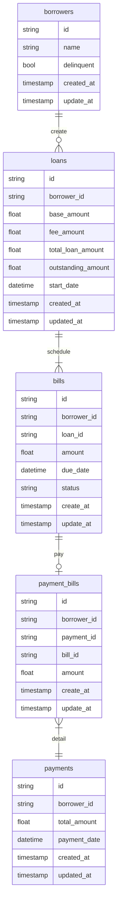

```mermaid
erDiagram
borrowers {
    string id
    string name
    bool delinquent
    timestamp created_at
    timestamp update_at
}
borrowers ||--o{ loans : create
loans {
    string id
    string borrower_id
    float base_amount
    float fee_amount
    float total_loan_amount
    float outstanding_amount
    datetime start_date
    timestamp created_at
    timestamp updated_at
}
loans ||--|{ bills: schedule
bills {
    string id
    string borrower_id
    string loan_id
    float amount
    datetime due_date
    string status
    timestamp create_at
    timestamp update_at
}
bills ||--o| payment_bills: pay
payment_bills {
    string id
    string borrower_id
    string payment_id
    string bill_id
    float amount
    timestamp create_at
    timestamp update_at
}
payment_bills }|--|| payments: detail
payments {
    string id
    string borrower_id
    float total_amount
    datetime payment_date
    timestamp created_at
    timestamp updated_at
}
```