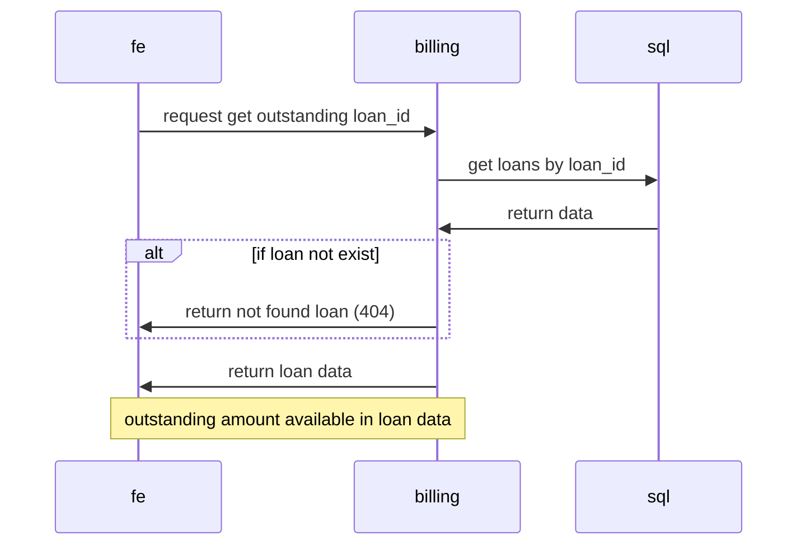
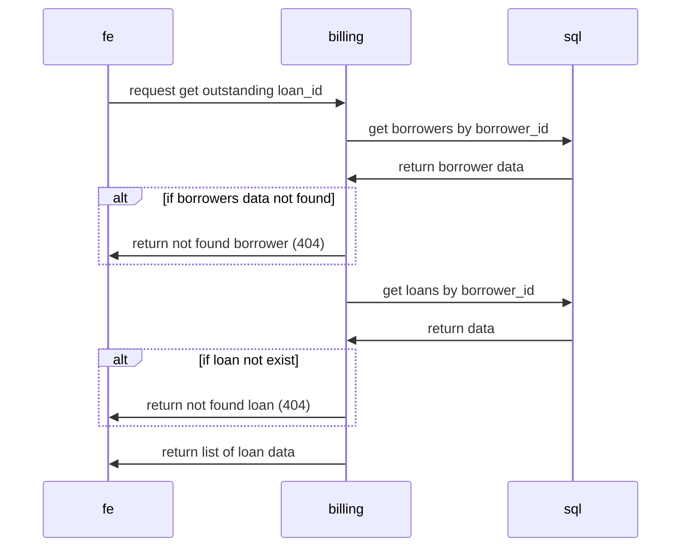

Get Outstanding Flow By loan_id

```mermaid
sequenceDiagram
    participant fe
    participant billing
    participant sql
    
    fe ->> billing: request get outstanding loan_id
    billing ->> sql: get loans by loan_id
    sql ->> billing: return data
    alt if loan not exist
        billing ->> fe: return not found loan (404)
    end
    billing ->> fe: return loan data
    note over billing,fe: outstanding amount available in loan data
```

Get Outstanding Flow By borrower_id

```mermaid
sequenceDiagram
    participant fe
    participant billing
    participant sql
    
    fe ->> billing: request get outstanding loan_id
    billing ->> sql: get borrowers by borrower_id
    sql ->> billing: return borrower data
    alt if borrowers data not found
        billing ->> fe: return not found borrower (404)
    end
    billing ->> sql: get loans by borrower_id
    sql ->> billing: return data
    alt if loan not exist
        billing ->> fe: return not found loan (404)
    end
    billing ->> fe: return list of loan data
```