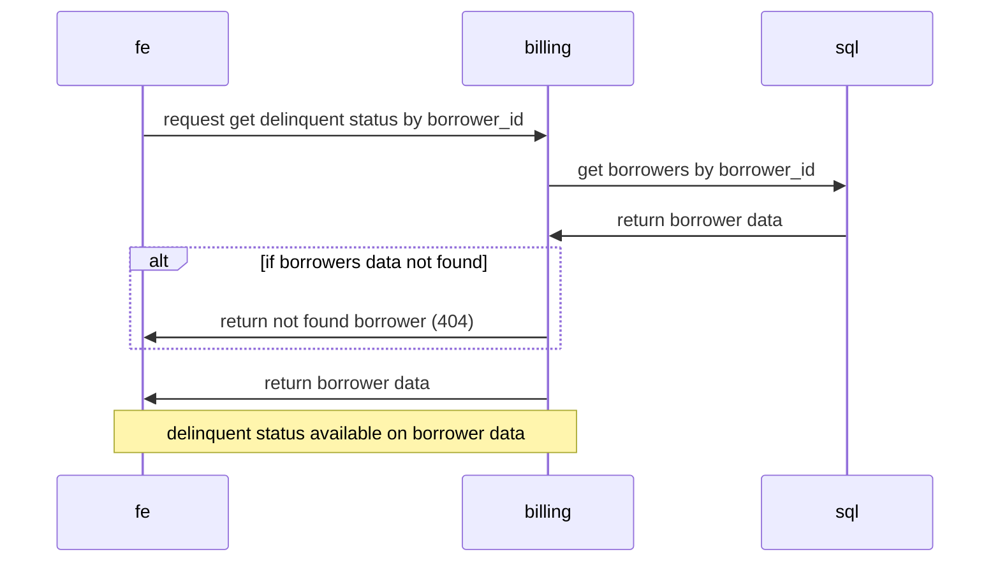

Get Delinquent Status By borrower_id

```mermaid
sequenceDiagram
    participant fe
    participant billing
    participant sql
    
    fe ->> billing: request get delinquent status by borrower_id
    billing ->> sql: get borrowers by borrower_id
    sql ->> billing: return borrower data
    alt if borrowers data not found
        billing ->> fe: return not found borrower (404)
    end
    billing ->> fe: return borrower data
    note over billing,fe: delinquent status available on borrower data
```