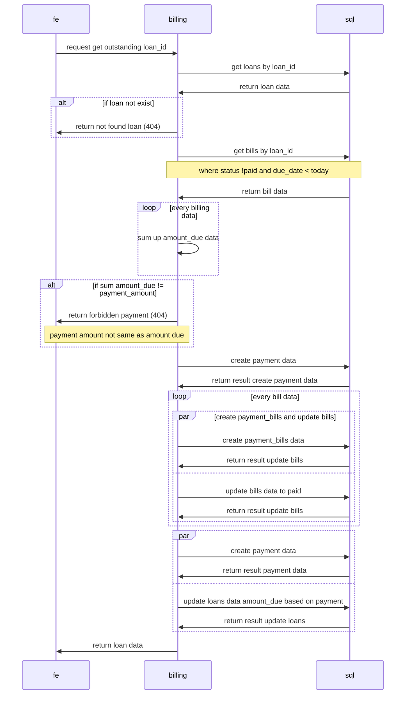

Flow make payment for borrower loan

```mermaid
sequenceDiagram
    participant fe
    participant billing
    participant sql

    fe ->> billing: request get outstanding loan_id
    billing ->> sql: get loans by loan_id
    sql ->> billing: return loan data
    alt if loan not exist
        billing ->> fe: return not found loan (404)
    end
    billing ->> sql: get bills by loan_id
    note over billing,sql: where status !paid and due_date < today
    sql ->> billing: return bill data
    loop every billing data
        billing ->> billing: sum up amount_due data
    end
    alt if sum amount_due != payment_amount
        billing ->> fe: return forbidden payment (404)
        note over billing,fe: payment amount not same as amount due
    end
    billing ->> sql: create payment data
    sql ->> billing: return result create payment data
    loop every bill data
        par create payment_bills and update bills
        billing ->> sql: create payment_bills data
            sql ->> billing: return result update bills 
        and
            billing ->> sql: update bills data to paid
            sql ->> billing: return result update bills
        end
    end
    par
        billing ->> sql: create payment data
        sql ->> billing: return result payment data
    and
        billing ->> sql: update loans data amount_due based on payment
        sql ->> billing: return result update loans
    end
    billing ->> fe: return loan data
```