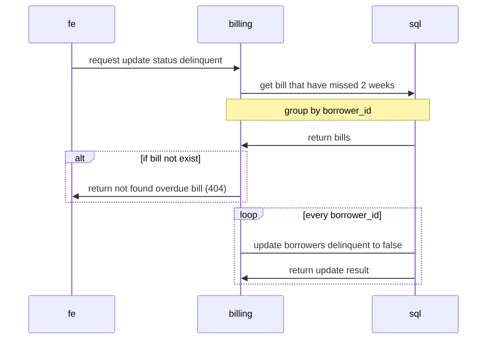

Get Outstanding Flow By loan_id

```mermaid
sequenceDiagram
    participant fe
    participant billing
    participant sql
    
    fe ->> billing: request update status delinquent
    billing ->> sql: get bill that have missed 2 weeks
    note over billing,sql: group by borrower_id
    sql ->> billing: return bills
    alt if bill not exist
        billing ->> fe: return not found overdue bill (404)
    end
    loop every borrower_id
        billing -> sql: update borrowers delinquent to false
        sql ->> billing: return update result
    end
```